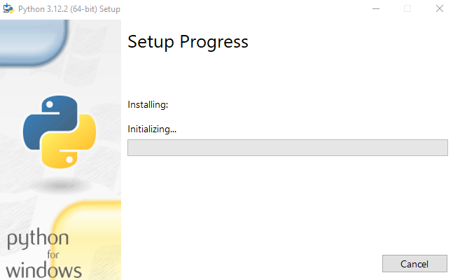

# Instalando o Python no Windows

Instalar o Python no Windows é um processo simples e direto. Abaixo, você encontrará um guia passo a passo usando o arquivo .exe baixado do site oficial do Python. Este guia assume que você está instalando uma versão recente do Python; no entanto, os passos devem ser bastante similares para versões mais antigas.

### Passo 1: Baixe o Instalador do Python

1. Acesse o site oficial do Python em [python.org](https://www.python.org/).
2. Passe o mouse sobre o menu "Downloads" no topo da página. O site normalmente detecta automaticamente o seu sistema operacional e oferece a versão recomendada para Windows. Clique em "Download Python" seguido pelo número da versão mais recente disponível para Windows (No momento é a versão 3.12.2).

3. Uma vez baixado o arquivo `.exe`, localize-o, geralmente na sua pasta de Downloads.

### Passo 2: Execute o Instalador

1. Dê um duplo clique no arquivo `.exe` baixado para iniciar o processo de instalação.
2. Na primeira tela do instalador, você verá duas opções importantes na parte inferior:
   - **Install Now (Recomendado)**: Instala o Python com as configurações padrão, o que é ideal para a maioria dos usuários.
   - **Customize Installation (Instalação Personalizada)**: Permite escolher componentes específicos para instalar e outras configurações, como o local de instalação.
3. **Importante**: Marque a caixa de seleção que diz "Add python.exe to PATH" antes de clicar em "Install Now" ou "Customize Installation". Isso adicionará o Python ao PATH do seu sistema, permitindo que você execute o Python e o pip (o gerenciador de pacotes do Python) a partir do prompt de comando.

### Passo 3: Prossiga com a Instalação

- Se você escolheu "Install Now":
  - Apenas aguarde enquanto o instalador configura tudo para você. Isso inclui a instalação do próprio Python, do pip, e de qualquer outro componente necessário.
- Se você escolheu "Customize Installation":
  - Você poderá escolher quais recursos instalar e onde instalar o Python. Siga as instruções na tela para personalizar sua instalação conforme necessário.

### Passo 4: Verificação da Instalação

1. Após a instalação ser concluída, você pode verificar se o Python foi instalado corretamente abrindo o Prompt de Comando (você pode pesquisar por "cmd" no menu Iniciar).
2. No Prompt de Comando, digite `python --version` e pressione Enter. Se o Python estiver instalado corretamente, ele exibirá a versão instalada.

3. Você também pode verificar a instalação do pip digitando `pip --version`.

### Passo 5: Pronto para Usar

- Agora que o Python está instalado, você pode começar a usar o interpretador Python ou desenvolver scripts. Para iniciar o interpretador Python, basta digitar `python` no Prompt de Comando.

Se você encontrar algum problema durante a instalação, certifique-se de revisar as instruções e verificar se o Python foi adicionado corretamente ao PATH. Em alguns casos, reiniciar o computador pode ser necessário para que as alterações no PATH entrem em vigor.